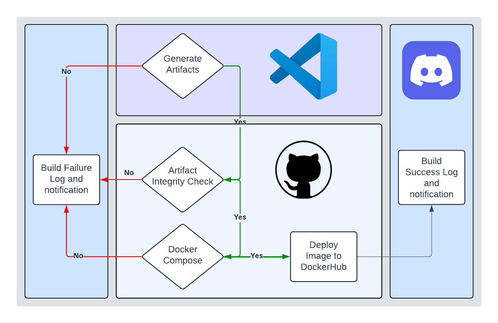

# Force Build Architecture

## Background

The lab, ideally, will have frequent usage and turnover of projects with many of the core details changing, such as model architecture or training methods. In order to get started on a new project, we would need to start from 0 every time.

#### Definitions
- Pipeline: an automated workflow of predefined sequentially run code separated into stages, which expect certain things on success from each of the stages predecessors
- Artifacts: a piece of data that is saved from an automation pipeline
- Polling: periodic requests for data and/or updates from a running pipeline
- Make: referring to GNU Make -- aka make files
- YAML: Yet Another Markup Language, used primarily for process automation with workflows and pipelines by creating the scope/content of each stage

#### Nomenclature

## Motivation 

## Proposal: Force Build

  
   
  <em>Use the force! Save the dream!</em>

#### Summary

####  Dataloader Streamlining

#### Model Build/Training Streamlining 

#### Evaluations as a Service

#### Version Control