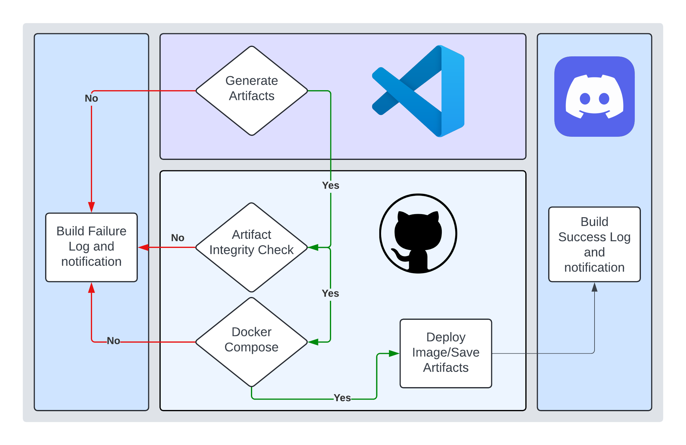

# Force Build Architecture

## Background

The lab, ideally, will have frequent usage and turnover of projects with many of the core details changing, such as model architecture or training methods. In order to get started on a new project, we would need to start from 0 every time.

#### Definitions
- Pipeline: an automated workflow of predefined sequentially run code separated into stages, which expect certain things on success from each of the stages predecessors
- Artifacts: a piece of data that is saved from an automation pipeline
- Polling: periodic requests for data and/or updates from a running pipeline
- Make: referring to GNU Make -- aka make files
- YAML: Yet Another Markup Language, used primarily for process automation with workflows and pipelines by creating the scope/content of each stage

#### Nomenclature

## Motivation 
As the lab scales in size and number of projects grows with it, we will have an increasing need of a quick way to bounce between projects. 
Currently, the level of effort involved in context switching to a new project is a bit unwieldy. Additionally, there are oftentimes a large need for extremely robust ablation studies, which will need to be tested under the same environment and constraints as the other implementations. Both of these issues can be solved with an easy to use framework of Force Build using a design approach of modularity and scalability.

## Proposal: Force Build

  

The idea behind Force Build is to have a quick set of local tooling at your disposal. It will consume whichever component of the Deep Learning pipeline you are currently working with and inherit the rest from a `common` build. 

In addition to the local tooling, this force build repo will allow for ease-of-use around deployments and training pipelines. We can automate the job deployments to servers and workstations so that we can better make use of our time and resources. This will be an easy way to ensure you are running uniformly as well as being able to have evaluations and metrics 1:1 match across all ablation studies. 

### Pipeline Strategy

  

#### DataLoader

A large piece of this automation tooling working properly is having a solid DataLoader that is abstract enough to handle the myriad of datasets we currently leverage, which will likely grow as more data unfolds.
The biggest key here should be forcing a data type. We should focus on using a `TensorDataset`, which is just a way of having all the data already converted into Tensors. You can think of this as a way to preprocess your data into a format that is agnostic to the specifics around the data you are utilizing at the time of training. 

In the purple box above, you can visualize the workflow here as 2 unique build styles surrounding a config file that will carry needed metadata. The `CustomExt` portion is just a way to override the common `DataLoader` in case of any optimization strategies around the actual data loading component of a training pipeline. This will be the extensible portion of the base class object of the `DataLoader`. It should be noted that the `CustomExt` is purely an optional add-in and completely up to the developer/researcher.

#### Model Training & Evaluation

In a similar fashion, model training is another component and focus for certain research efforts. The developer/researcher will be able to override this base class object in the same way it would be done in `DataLoader` stage. 

We should also have the same implementation and overrides enabled for evaluation portion, but it is important to note that some optimization methods may require a custom evaluation while maintaining a standard training workflow. To satisfy this possibility, force build will keep these implementations as their own class objects inheriting from a shared base class.

#### Model Architecture

One of the required components of this workflow will be the model itself. It is important to have this as flexible as possible, so this stage should be able to tackle all common model definitions:

- model directory saves
- model saves as a JSON
- model saves as a pkl/binary
- defined model file (class object) 

#### Docker Containerization

This component, outlined in the blue box, will be both a capability for pipeline triggers or local runs. The containers will either host on a local port or it will deploy to docker hub and trigger a cloud service. In both cases, these containers will generate logging files for training, evaluation, and metadata. At the end of each training completion, there will be artifacts generated. These artifacts will be in the form of model checkpoints, config JSON's, evaluation metrics, training information, and any other workflow information.

## Open Questions

- Are there any important sections in this workflow that I have left out?
- Will there ever be a need for multiple models at a single time?
- How should we provide a list of components for ablation studies? 
- Should the ablation studies be automated in anyway? currently it is a manual iteration.